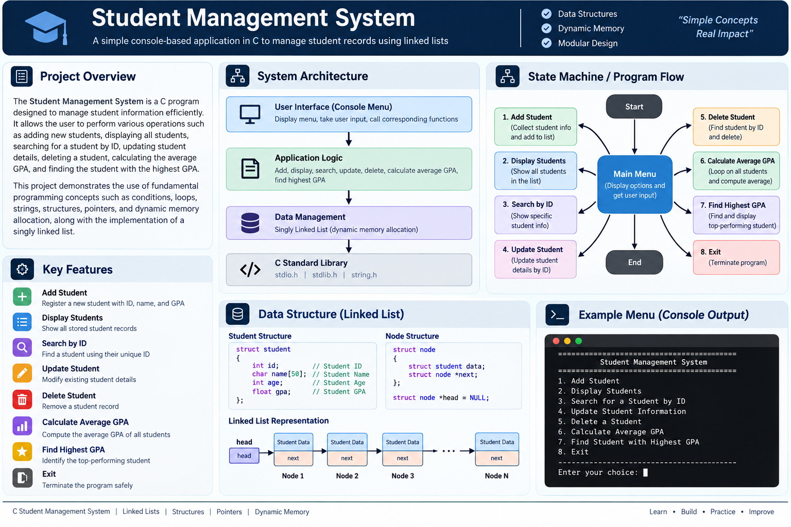

# C Student Management System

A console-based **Student Management System written in C**, designed to manage student records using a singly linked list and dynamic memory allocation.

The system allows users to add, display, search, update, and delete student records, as well as calculate the average GPA and find the student with the highest GPA.

---

## Project Overview

This project was developed as part of the **Standard Embedded Systems Diploma – C Project**.

The project focuses on applying fundamental C programming concepts to a practical data-management application.

The main concepts demonstrated are:

- Structures
- Pointers
- Linked Lists
- Dynamic Memory Allocation
- Strings
- Functions
- Loops
- Conditional Statements
- Searching and Traversal
- Memory Management

---

## Architecture

The application is organized into three main parts:

    +------------------------------------------------+
    |                 USER INTERFACE                 |
    |                  Console Menu                  |
    +------------------------------------------------+
                           |
                           v
    +------------------------------------------------+
    |                APPLICATION LOGIC               |
    |                                                |
    | Add | Display | Search | Update | Delete       |
    | Average GPA | Highest GPA | Exit              |
    +------------------------------------------------+
                           |
                           v
    +------------------------------------------------+
    |                 DATA MANAGEMENT                |
    |                                                |
    |              Singly Linked List                |
    |                                                |
    |        Student Data + Next Pointer             |
    +------------------------------------------------+

---

## Features

### Add Student

Adds a new student to the linked list.

The system:

- Collects student information
- Checks whether the student ID already exists
- Allocates memory for a new node
- Stores the student data
- Adds the node to the linked list

### Display Students

Displays all student records currently stored in the linked list.

The system traverses the list and prints each student's information.

### Search Student by ID

Searches for a student using their unique ID.

If the student is found, their information is displayed.

If the ID does not exist, the system reports that the student was not found.

### Update Student

Updates the information of an existing student using their ID.

The system can update:

- Name
- Age
- GPA

### Delete Student

Deletes a student from the linked list using their ID.

The system adjusts the linked-list pointers and releases the memory allocated for the removed node.

### Calculate Average GPA

Calculates the average GPA of all students currently stored in the linked list.

### Find Highest GPA

Traverses the linked list and finds the student with the highest GPA.

### Exit

Terminates the application safely.

---

## Student Data Structure

The project uses a structure to store student information:

    struct student
    {
        int id;
        char name[50];
        int age;
        float gpa;
    };

Each student is stored inside a linked-list node:

    struct node
    {
        struct student data;
        struct node *next;
    };

    struct node *head = NULL;

Each node contains the student's information and a pointer to the next node.

---

## Linked List

Student records are managed using a singly linked list.

    head
      |
      v
    +----------------+     +----------------+     +----------------+
    | Student Data   |     | Student Data   |     | Student Data   |
    | next ----------|---->| next ----------|---->| next ----------|
    +----------------+     +----------------+     +----------------+
          Node 1                 Node 2                 Node 3
                                                           |
                                                           v
                                                         NULL

This allows student records to be added and removed dynamically during program execution.

---

## Program Flow

    +----------------+
    |     START      |
    +-------+--------+
            |
            v
    +----------------+
    |    Main Menu   |
    +-------+--------+
            |
            v
    +-------------------------------+
    | Select Operation              |
    +-------------------------------+
            |
      +-----+-----+-----+-----+-----+
      |     |     |     |     |     |
      v     v     v     v     v     v
     Add  Display Search Update Delete GPA
      |     |     |     |     |     |
      +-----+-----+-----+-----+-----+
                    |
                    v
               Return Menu
                    |
                    v
                  Exit

---

## Main Menu

The application provides the following operations:

    ========================================
           Student Management System
    ========================================

    1. Add Student
    2. Display Students
    3. Search for a Student by ID
    4. Update Student Information
    5. Delete a Student
    6. Calculate Average GPA
    7. Find Student with Highest GPA
    8. Exit

    Enter your choice:

---

## Function Overview

| Function | Purpose |
|---|---|
| `main()` | Controls the application menu and program flow |
| `addStudent()` | Adds a new student to the linked list |
| `displayStudents()` | Displays all student records |
| `searchStudentByID()` | Searches for a student by ID |
| `updateStudent()` | Updates an existing student's information |
| `deleteStudent()` | Removes a student from the linked list |
| `calculateAverageGPA()` | Calculates the average GPA |
| `searchHighestGPA()` | Finds the student with the highest GPA |

---

## Dynamic Memory Management

The project uses dynamic memory allocation to create linked-list nodes at runtime.

When a student is added, memory is allocated for a new node.

When a student is deleted, the node is removed from the linked list and its allocated memory is released.

This demonstrates practical use of:

- `malloc()`
- Pointers
- Dynamic memory
- `free()`
- Linked-list node management

---

## Data Management Flow

    User Input
        |
        v
    Student Data
        |
        v
    Create Node
        |
        v
    Add to Linked List
        |
        v
    +-----------------------------+
    |        Linked List          |
    |                             |
    | Node -> Node -> Node -> ... |
    +-----------------------------+
        |
        +----> Display
        |
        +----> Search
        |
        +----> Update
        |
        +----> Delete
        |
        +----> GPA Calculations

---

## C Concepts Demonstrated

### Structures

Used to organize student information into structured data.

### Pointers

Used to connect linked-list nodes and access dynamically allocated memory.

### Linked Lists

Used as the main data structure for storing student records.

### Dynamic Memory Allocation

Used to create and remove student nodes during runtime.

### Strings

Used to store student names.

### Functions

Used to divide the application into separate reusable operations.

### Loops

Used for menu execution and linked-list traversal.

### Conditional Statements

Used for user choices, validation, searches, and program control.

---

## Project Structure

    C-Student-Management-System/
    |
    +-- README.md
    +-- C-Student-Management-Architecture.png
    |
    +-- Source/
        +-- C project source files

---

## Learning Outcomes

This project provided practical experience with:

- C programming
- Structures
- Pointers
- Linked lists
- Dynamic memory allocation
- Memory management
- Searching and traversal
- Data manipulation
- Functions and modular programming
- Menu-driven applications
- GPA calculations

---

## Author

**Adham Muhammed**

Embedded Software Engineer
- RTOS
- AUTOSAR
- Microcontroller Drivers
